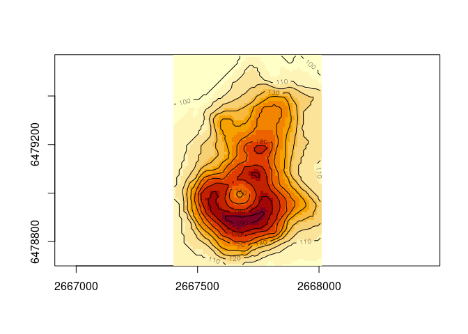

<!-- README.md is generated from README.Rmd. Please edit that file -->

# volcano

<!-- badges: start -->
<!-- badges: end -->

The goal of volcano is to georeference the `volcano` data set.

## Installation

You can install the development version of volcano from
[GitHub](https://github.com/) with:

``` r
# install.packages("devtools")
devtools::install_github("mdsumner/volcano")
```

## Example

This is a basic example which shows you how to solve a common problem:

``` r
library(volcano)
## basic example code
image(volc, asp = 1)

(vtiff <- terra::rast(system.file("extdata/volcano.tif", package = "volcano", mustWork = TRUE)))
#> class       : SpatRaster 
#> dimensions  : 87, 61, 1  (nrow, ncol, nlyr)
#> resolution  : 10, 10  (x, y)
#> extent      : 2667394, 2668004, 6478902, 6479772  (xmin, xmax, ymin, ymax)
#> coord. ref. : +proj=nzmg +lat_0=0 +lon_0=0 +x_0=0 +y_0=0 +datum=WGS84 +units=m +no_defs 
#> source      : volcano.tif 
#> name        : lyr.1 
#> min value   :    94 
#> max value   :   195
terra::contour(vtiff, add = TRUE)
```



See the vignette for more.

## Code of Conduct

Please note that the volcano project is released with a [Contributor
Code of
Conduct](https://contributor-covenant.org/version/2/0/CODE_OF_CONDUCT.html).
By contributing to this project, you agree to abide by its terms.
